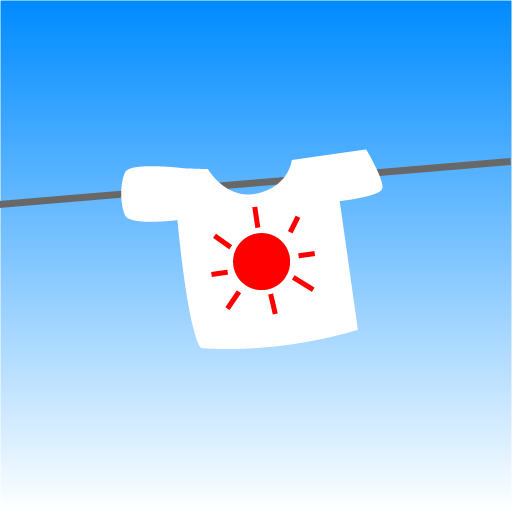
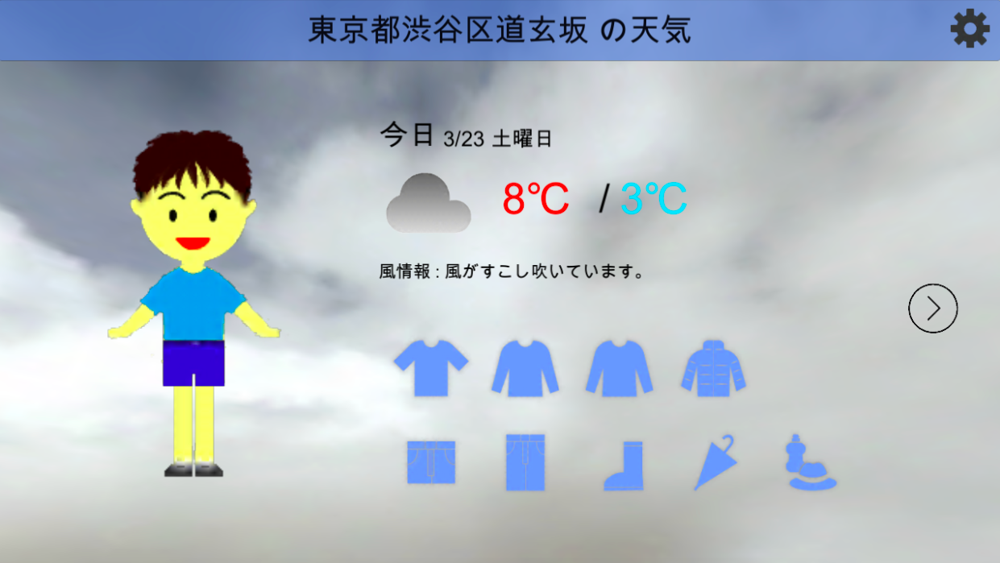

    
    <h1>今日の洋服何着てく？</h1>

    

**今日の洋服何着てく？** は、Unity で制作されたスマートフォン向け天気情報アプリケーションです。

天気情報を表示するのが主ではなく、おすすめの洋服のアルゴリズムを表示するためのアプリケーションとして開発されています。

2018年9月に開催された[「Tech Kids Grand Prix 2018」](https://techkidsschool.jp/grandprix/2018)に応募するために、Android・iOS両対応のスマートフォンアプリケーションとして開発されました。
また、2019年1月に[「Kids Creator's Studio」(第2回)](https://edex.adobe.com/jp/kids-creators-studio)が開催された際、UI デザインを大幅に修正したバージョンが App Store に公開されました（現在は削除済み）。

## 機能
- 今日・明日の最低気温・最高気温表示
- アバターの性別変更

## 実績
- [Tech Kids Grand Prix 2018](https://techkidsschool.jp/grandprix/2018) <b>自由制作部門 第二位</b>

## ライセンス
このプロジェクトは Apache License 2.0 でオープンソースとして提供されています。

GitHub へのアップロードにあたり、一部の有償アセットや再配布禁止アセットを除外しています。
- /Assets/SimpleCloudSystem by RM
- /Assets/Sounds
- /Assets/Standard Assets
- /Assets/Simple Health Bar
